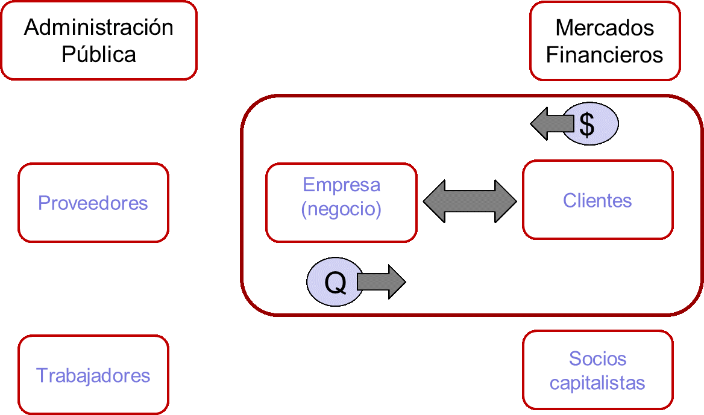

---
output:
  revealjs::revealjs_presentation:
    theme: simple
    slide_level: 2
    highlight: pygments
    center: false
    self_contained: true
    css: "../css/styles.css"
    reveal_options:
      slideNumber: true
      previewLinks: false
      transition: 0
      background_transition: 0
---

```{r setup, include=FALSE}
knitr::opts_chunk$set(echo = FALSE, dev="svg")
```

```{r include=FALSE}
if(!require("tidyverse")) {
  install.packages("tidyverse")
  library("tidyverse")
}
if(!require("kableExtra")) {
  install.packages("kableExtra")
  library("kableExtra")
}
```

##


<div style="font-size:1.5em;font-weight:700;margin-top:200px;">Control estadístico de procesos</div>
<div style="font-size:1.4em;font-weight:500;color:#333333;">Introducción a la calidad</div>
<div style="font-size:1.2em;margin-top:40px;color:#333333;">Jordi Cuadros, Lucinio González</div>
<div style="margin-top:80px;color:#333333;">Septiembre de 2018</div>


# Negocios y calidad

## ¿Qué es un negocio?
Un **negocio** es un proceso **repetitivo** que crea **riqueza**.



Kaufman, J. (2010). The personal MBA: Master the art of business. Penguin. 

----

**Un negocio es un conjunto de procesos que pueden repetirse de manera fiable para conseguir un resultado concreto y generar riqueza.**

- *Si no es capaz de describir su trabajo como un proceso, no ha entendido en qué consiste.* (W.E. Deming)
- *Conseguir la satisfacción del cliente es la mejor estrategia de negocios posible* (Michael Leboeuf)
- *Siempre he creído que para un negocio o un servicio prosperen, tienen que ofrecer calidad. Un producto o un servicio excelente son su mejor punto de venta.* (Victor Kiam)

*RAE: Conjunto de las fases sucesivas de un fenómeno natural o de una operación artificial.*


## Calidad

Grado en el que un conjunto de características inherentes a un objeto (producto, servicio, proceso, persona, organización, sistema o recurso) cumple con los requisitos. (ISO 9000)

¿Quién decide los requisitos?   **El cliente**

**Hay un único jefe: el cliente.**

*Es capaz de despedir a todo el personal de la empresa, desde el más alto cargo hasta el último de la fila, solo con gastarse el dinero en otra parte.* (Sam Walton, fundador de Walmart)


## Los negocios de éxito…

1.  crean o nos ofrecen algo de **valor**, 
2.  que los demás **queremos** o **necesitamos**
3.  a un **precio** que estamos dispuestos a pagar,
4.  porque satisface nuestras necesidades y **expectativas** como compradores 
5.  y genera suficientes **ingresos** a la empresa de modo que a los propietarios les resulte rentable seguir operando.

*El **precio** es lo que se paga, el **valor** es lo que se obtiene* (Warren Buffet)


## Productos de valor

- Crear un artículo tangible que la gente desee.
- Producir ese artículo con el menor coste posible y con un nivel de **calidad aceptable**.
- Vender tantas unidades como sea posible al máximo precio que el mercado permita.
- Conservar un inventario de productos acabados para poder satisfacer los pedidos que vayan llegando.


## Servicios de valor

- Tener empleados que dominen una técnica o tengan una capacidad para hacer algo que los demás necesiten pero que no puedan o no quieran hacer, en el presente o en el futuro.
- Ofrecer un servicio de **gran calidad**.
- Atraer y retener clientes dispuestos a pagar.
- Los servicios dependen de la inversión de tiempo y energía de la persona que facilita el servicio y estos dos recursos son finitos.

Es fundamental cobrar el **precio adecuado**. 


## Historia de la calidad

### Etapa artesanal

**Hacer las cosas bien** independientemente del coste o esfuerzo necesario para ello.

Finalidades:

- Satisfacer al cliente.
- Satisfacer al artesano, por el trabajo bien hecho
- Crear un producto único.

----

### Revolución Industrial

**Hacer muchas cosas** no importando que sean de calidad (Se identifica producción con calidad).

Finalidades:

- Satisfacer una gran demanda de bienes.
- Obtener beneficios.

----

### Segunda Guerra Mundial

**Asegurar la eficacia del armamento** sin importar el costo, con la mayor y más **rápida producción** (eficacia + plazo = calidad)

Finalidad:

- Garantizar la disponibilidad de un armamento eficaz en la cantidad y el momento preciso.

----

### Posguerra -- Japón

**Hacer las cosas bien a la primera**

Finalidades:

- Minimizar costes
- Satisfacer al cliente
- Ser competitivo

----

### Posguerra -- Resto del mundo

Producir, **cuanto más mejor**

Finalidad: 

- Satisfacer la gran demanda de bienes causada por la guerra

----

### Etapa del control de calidad

Técnicas de **inspección** en la producción para **evitar la salida** de bienes defectuosos

Finalidades:

- Satisfacer las necesidades técnicas del producto

----

### Etapa del aseguramiento (garantía) de la calidad

Sistemas y **procedimientos** de la organización para evitar que se produzcan bienes defectuosos

Finalidades:

- Satisfacer al cliente
- Prevenir errores
- Reducir costes
- Ser competitivo

----

### Calidad total

Teoría de la **administración** empresarial centrada en la permanente **satisfacción de las expectativas** del cliente

Finalidades:

- Satisfacer tanto al cliente externo como interno
- Ser competitivo
- Mejora contínua


# Calidad total (TQM, Total Quality Management)

##  Definición

Es una **estrategia de gestión** a través de la cual la empresa satisface las necesidades y expectativas

- de sus clientes,
- de sus empleados,
- de los accionistas, y
- de toda la sociedad en general,

utilizando los recursos de que dispone:

- personas,
- materiales,
- tecnología,
- sistemas de producción, etc.


----

<p>&nbsp;</p>
<p>&nbsp;</p>


```{r, echo = FALSE, results = 'asis'}
df <- data.frame(c("QUÉ", "CÓMO", "MÉTODO", "DÓNDE", "QUIÉN", "CUÁNDO" ),
                 c("Satisfacción de clientes externos e internos", "Utilización eficiente de reursos", "Mejora contínua", "Aplicación de todos los procesos y actividades", "Participación de todas las personas de la empresa", "Siempre"))
tb <- kable_styling(kable(df))
gsub("<thead>.*</thead>", "", tb)

```

