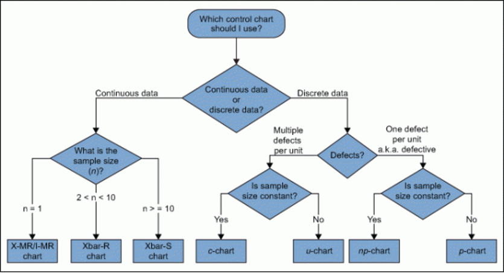
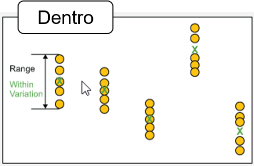
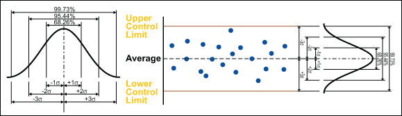
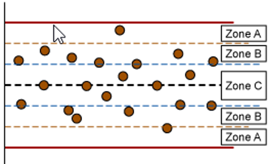
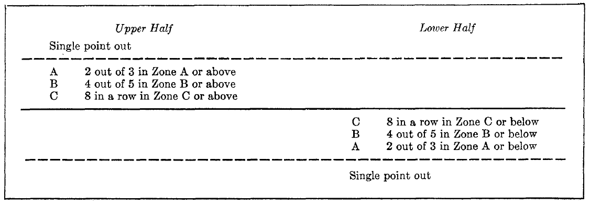
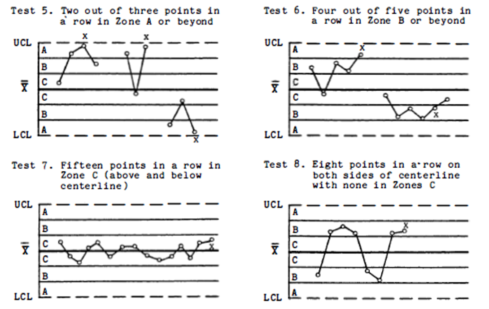
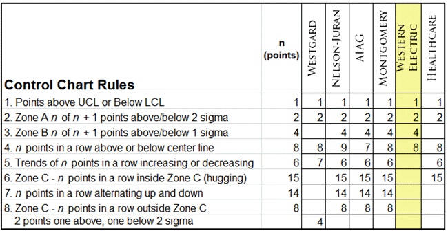
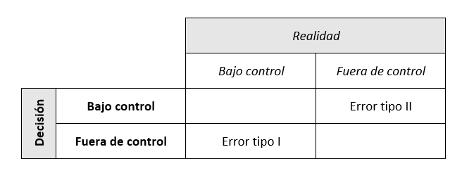
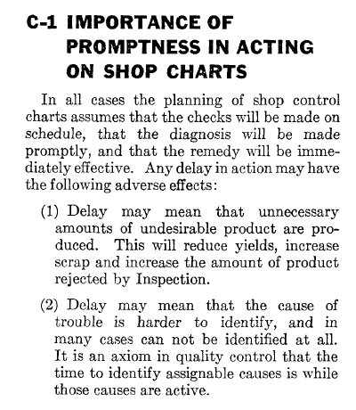
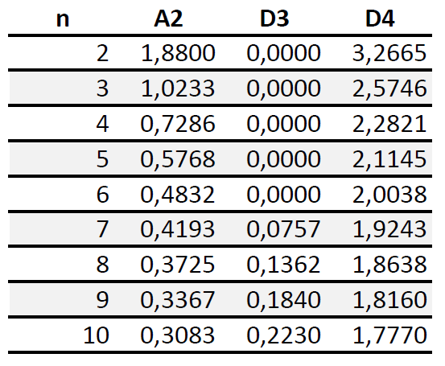

---
output:
  revealjs::revealjs_presentation:
    theme: simple
    slide_level: 2
    highlight: pygments
    center: false
    self_contained: true
    css: "../css/styles.css"
    reveal_options:
      slideNumber: true
      previewLinks: false
      transition: 0
      background_transition: 0
---

```{r setup, include=FALSE}
knitr::opts_chunk$set(echo = FALSE, dev="svg")
```

```{r include=FALSE}
if(!require("tidyverse")) {
  install.packages("tidyverse", repos="https://cloud.r-project.org/",
         quiet=TRUE, type="binary")
  library("tidyverse")
}
if(!require("kableExtra")) {
  install.packages("kableExtra", repos="https://cloud.r-project.org/",
         quiet=TRUE, type="binary")
  library("kableExtra")
}
```

##


<div style="font-size:1.5em;font-weight:700;margin-top:200px;">Control estadístico de procesos</div>
<div style="font-size:1.4em;font-weight:500;color:#333333;">Gráficos de control</div>
<div style="font-size:1.2em;margin-top:40px;color:#333333;">Jordi Cuadros, Lucinio González</div>
<div style="margin-top:80px;color:#333333;">Setiembre de 2018</div>


# Introducción a los gráficos de control

## Variabilidad y control estadístico

- Todo proceso tiene una **variabilidad natural** inherente al mismo.
- Un proceso que solo presenta variabilidad natural se dice que está **bajo control estadístico**.
- Si existen **causas especiales de variabilidad**, se deben **eliminar** una a una, de forma que al final solo quede la variabilidad natural del proceso y el proceso esté bajo control estadístico.
- Si se han eliminado los errores sistemáticos (que derivan de causas especiales), **la media de un conjunto de medidas repetidas** (muestra) es la mejor estimación que se puede realizar del verdadero valor de la medida (valor real).


## Gráficos de control

Un gráfico de control es una representación gráfica (gráfico de secuencia) de un característica (cuantitativa -variable- o cualitativa -atributo-) de un proceso en función de un índice de secuencia (tiempo).

Fueron propuestos por Shewhart en 1924.

<p>&nbsp;</p>

<p class="bibref">Shewhart, W. A. (1924). Some applications of statistical methods to the analysis of physical and engineering data. *Bell System Technical Journal*, 3(1), 43-87</p>

----


<!-- LC: Línea central<br /> -->
<!-- LSC: Límite superior de control<br /> -->
<!-- LIC: Límite inferior de control<br /> -->


## Funciones de los gráficos de control

- Ayudan a mejorar la productividad (menos no conformes)
- Ayudan a prevenir defectos
- Evitan ajustes innecesarios del proceso (es capaz de distinguir entre variabilidad natural y variabilidad por causas especiales)
- Facilitan información para la detección de causas especiales (formas no aleatorias características)
- Permiten la evaluación de la capacidad del proceso


## Tipos de gráficos de control


- Para variables (numéricas)
  
  | Tendencia central | Dispersión        |
  |:------------------|:------------------|
  | Gráfico Xbarra    | Gráfico s         |
  | Gráfico I         | Gráfico R (MR)    |
  
  
- Para atributos
  
  | Unidades defectuosas  | Defectos          |
  |:----------------------|:------------------|
  | Gráfico np            | Gráfico c         |
  | Gráfico p             | Gráfico u         |
  

## Criterios de selección



<p class="bibref">https://www.isixsigma.com/tools-templates/control-charts/a-guide-to-control-charts/</p>


## Subgrupos racionales

Casi todos los gráficos de Shewhart se basan en subgrupos (subgrupos racionales o muestras)

El tamaño de los subgrupos debe ser tal que si hay causas asignables no se manifiesten dentro de los subgrupos y su efecto sea máximo entre grupos.

Habitualmente se trabaja con muestras de tamaño entre 2 y 10 (siendo 4 o 5, los tamaños de muestra más habituales).

----



<p class="bibref">https://www.isixsigma.com/tools-templates/control-charts/a-guide-to-control-charts/</p>

----


<p class="bibref">https://www.isixsigma.com/tools-templates/control-charts/a-guide-to-control-charts/</p>


# Uso e interpretación de un gráfico de control

## Control estadístico



----

Si el proceso está bajo control estadístico en su gráfico de control se puede observar que:

- Los valores individuales no son constantes, pero se distribuyen al azar (distribución normal)
- Se mantienen constantes a largo plazo la **media** (nivel) y la **desviación estándar** (variabilidad) 

No se observan:

-	valores atípicos,
- cambios en el nivel, 
- cambios en la variabilidad
- tendencias, movimientos periódicos, autocorrelación...


## Límites de control



<p class="bibref">https://www.isixsigma.com/tools-templates/control-charts/using-control-charts-or-pre-control-charts/</p>


## Reglas de Western Electric



<p class="bibref">Western Electric Company. (1956). *Statistical quality control handbook*. Western Electric Company.</p>


## Reglas de Nelson


----



<p class="bibref">Nelson, L. S. (1984). The Shewhart control chart—tests for special causes. *Journal of quality technology*, 16(4), 237-239.</p>


## Más reglas (o menos)



<p class="bibref">https://www.qimacros.com/control-chart/western-electric-rules/</p>


## ¿Qué reglas usar?

- Las reglas (1 y 2 de Nelson) suelen usarse siempre tanto para nivel como para variabilidad.
- Las reglas basadas en zonas no suelen aplicarse a los gráficos de variabilidad.
- Añadir más reglas o disminuir el nivel de alerta, incrementa el riesgo de error de tipo I y disminuye el riesgo de error de tipo II.

{style=width:80%;margin-left:-40%;}


## ¿Cuándo actuar?
<p class="bibref">Western Electric Company. (1956). *Statistical quality control handbook*. Western Electric Company.</p>

{style=width:50%;margin-left:-25%;}


# Construcción de gráficos de control

## Estructura del apartado

- Gráficos de control para variables
    - Gráfico Xbarra-R
        - Con líneas de control preestablecidas
        - Cálculo de las líneas de control
    - Gráfico I-MR
- Gráficos de control para atributos
    - Gráfico p


## Gráfico de control para variables

Se usan para aquellas variables que se determinan cuantitativamente.

La medida debe permitir la observación de la variabilidad. Si la medida tiene demasiada incertidumbre, estas técnicas no seran fiables.

## Gráfico Xbarra-R

Es el tipo de gráfico de control más usado.

Normalmente, la práctica de los gráficos de control implica dos fases diferenciadas:

- Fase I: Cálculo de las líneas de control
- Fase II: Representación y uso del gráfico de control (análisis e interpretación)

Debe tenerse en cuenta el tamaño de muestra. En todos los casos, se asume que la determinación del subgrupo racional y el muestreo son adecuados y no producen sesgo.


## Gráfico Xbarra-R -- con líneas de control preestablecidas

Conocido el tamaño de muestra, se incluyen en el gráfico de control las últimas 15-50 muestras (nunca menos de 10).

1. Para cada muestra, se determina el promedio y el recorrido.
2. Se representan los recorridos en el gráfico R, mediante puntos unidos con segmentos rectos. En el gráfico se incluen las líneas de control (LC, LCI, LCS).
3. Se representan los recorridos en el gráfico Xbarra, mediante puntos unidos con segmentos rectos. Se añaden al gráfico las líneas de control (LC, LCI, LCS).

----

En una planta de fabricación de neveras, se han establecido las siguientes líneas de control (gráficos Xbarra-R) para el control del grosor de la capa de pintura. Paa cada turno, se inspecciona una muestra de 5 neveras.

|          |Xbarra    |R         |
|:--------:|:--------:|:--------:|
|LCS       |2,960     |1,63      |
|LC        |2,515     |0,77      |
|LCI       |2,070     |0,00      |

<p>&nbsp;</p>

<p class="bibref">Adaptado de Wild, C. J., & Seber, G. A. F. (2000). Chance encounters. John Wiley & Sons</p>

----

```{r, echo = FALSE, results = 'asis'}
datos <- data.frame(shift=1:20,
      s1=c(2.7,2.6,2.3,2.8,2.6,
           2.2,2.2,2.8,2.4,2.6,
           3.1,2.4,2.1,2.2,2.4,
           3.1,2.9,1.9,2.3,1.8),
      s2=c(2.3,2.4,2.3,2.3,2.5,
           2.3,2.6,2.6,2.8,2.3,
           3.0,2.8,3.2,2.8,3.0,
           2.6,2.4,1.6,2.6,2.8),
      s3=c(2.6,2.6,2.4,2.4,2.6,
           2.7,2.4,2.6,2.4,2.0,
           3.5,2.2,2.5,2.1,2.5,
           2.6,2.9,2.6,2.7,2.3),
      s4=c(2.4,2.3,2.5,2.6,2.1,
           2.2,2.0,2.7,2.2,2.5,
           2.8,2.9,2.6,2.2,2.5,
           2.8,1.3,3.3,2.8,2.0),
      s5=c(2.7,2.8,2.4,2.7,2.8,
           2.6,2.3,2.5,2.3,2.4,
           3.0,2.5,2.8,2.4,2.0,
           2.1,1.8,3.3,3.2,2.9))
kable_styling(kable(datos), font_size=18)
```

----

```{r, echo = TRUE}
promedio <- apply(datos[,2:6],1,mean)
rango <- apply(datos[,2:6],1,function (x) diff(range(x)))
promedio
rango

resumen <- data.frame(shift=datos$shift,promedio,rango)
str(resumen)
```

## Gráfico Xbarra-R -- cálculo de las líneas de control

Las líneas de control deben calcularse exclusivamente con datos que correspondan al **proceso bajo control** en las **mismas condiciones** de producción.

----

Para conseguir estos datos se siguen una de las dos aproximaciones siguientes:

- Buscar una ventana de datos donde el proceso esté bajo control,
- Iterar excluyendo aquellos datos que estan fuera de control
      1. Tomar los últimos datos disponibles
      2. Realizar el gráfico de control de recorridos
      3. Excluir las muestras que estan fuera de control
      4. Recalcular el gráfico de recorridos y hacer el gráfico de promedios
      5. Excluir las muestras que estan fuera de control
      6. Recalcular los gráficos de control hasta que no haya muestras fuera de control
      7. Tomar como referencia estas líneas de control


## Cálculo de las líneas de control

Para construir los gráficos se usan fórmulas y constantes preestablecidas

Se pueden encontrar en la bibliografía

<a href="http://www.world-class-quality.com/uploads/Download/2017080116220211ControlChartConstantsandFormulae.pdf">2017080116220211ControlChartConstantsandFormulae.pdf</a> 


## Cálculo de las líneas de control en un gráfico R

{style=width:50%;margin-left:-25%;}


## Cálculo de las líneas de control en un gráfico Xbarra (a partir de R)

{style=width:50%;margin-left:-25%;}


## Constantes para el gráfico Xbarra-R

{style=width:50%;margin-left:-25%;}


## Ejemplo

En el proceso de fabricación de un producto en polvo se determina su humedad tomando 5 muestras de cada lote producido.

¿Cómo podemos determinar si el proceso está funcionando según lo previsto?

Los datos se encuentran en el archivo <a href="humedad.txt">humedad.txt</a>

