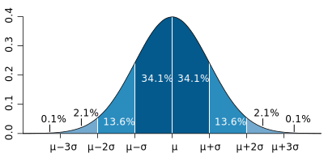

---
output:
  revealjs::revealjs_presentation:
    theme: simple
    slide_level: 2
    highlight: pygments
    center: false
    self_contained: true
    css: "../css/styles.css"
    reveal_options:
      slideNumber: true
      previewLinks: false
      transition: 0
      background_transition: 0
editor_options: 
  chunk_output_type: console
---

```{r setup, include=FALSE}
knitr::opts_chunk$set(echo = FALSE, dev="svg")
```

```{r include=FALSE}
if(!require("tidyverse")) {
  install.packages("tidyverse", repos="https://cloud.r-project.org/",
         quiet=TRUE, type="binary")
  library("tidyverse")
}
if(!require("nortest")) {
  install.packages("nortest", repos="https://cloud.r-project.org/",
         quiet=TRUE, type="binary")
  library("normtest")
}
if(!require("kableExtra")) {
  install.packages("kableExtra", repos="https://cloud.r-project.org/",
         quiet=TRUE, type="binary")
  library("kableExtra")
}
```

##


<div style="font-size:1.5em;font-weight:700;margin-top:200px;">Control estadístico de procesos</div>
<div style="font-size:1.4em;font-weight:500;color:#333333;">Especificaciones y capacidad</div>
<div style="font-size:1.2em;margin-top:40px;color:#333333;">Jordi Cuadros, Lucinio González</div>
<div style="margin-top:80px;color:#333333;">Octubre de 2018</div>


# Especificaciones

## ¿Qué son las especificaciones?

**Especificación**

Información proporcionada por el fabricante de un producto, la cual describe sus componentes, características y funcionamiento. A menudo constituye el compromiso con el cliente.

- Características
    - Atributos: conformidad
    - Variables: valor dentro de unos límites (LIE, LSE)
- Las especificaciones no estan especificadas por el proceso productivo ni se determinan estadísticamente.


## ¿Cómo se relacionan con el proceso productivo?

- La probabilidad con la que se cumplirán unas especificaciones depende de las características del proceso.
    - Valor central
    - Variabilidad natural

- Distintos procesos productivos pueden tolerar distintos niveles de no conformidad.


## El concepto de capacidad

La capacidad del proceso es la aptitud que tiene éste para producir dentro del intervalo fijado por las especificaciones.

{style=width:60%;margin-left:-30%;}

----

Para realizar un estudio de capacidad de un proceso, se ha de cumplir las siguientes condiciones:

- El proceso debe estar bajo control estadístico, es decir media y variabilidad estable a lo largo del tiempo.
- Los datos deben seguir una distribución normal.
- La muestra debe ser representativa (materiales de partida, ajustes de máquina, cambio de operarios, condiciones ambientales, desgaste...).

----

En estas condiciones, se puede usar la distribución normal para establecer la capacidad del proceso y relacionar

- las características del mismo (valor central y variabilidad natural), con
- las especificaciones (valor nominal, límite inferior/superior de la especificación).


A partir de la misma puede también determinarse la probabilidad de obtener unidades no conformes con una determinada especificación.


# Distribución normal

## Definición

La **distribución normal** es una distribución teórica simétrica comúnmente usada para la modelización matemática de valores afectados de error aleatorio.

{style=width:60%;margin-left:-30%;}

<span style="font-size:18pt;">https://commons.wikimedia.org/wiki/File:Standard_deviation_diagram_micro.svg</span>


## Ejemplos

Sea un proceso productivo en el que se fabrican láminas de acero. Se ha establecido que la dureza promedio de las piezas producidas es 316 HB y la desviación estándar de las mismas es 25 HB.

Asumiendo que esta variable, sigue una distribución normal determina:

- ¿Qué proporción de piezas tienen un dureza inferior a 250 HB? ¿Y una superior a 350 HB?
- Si se establecen una especificaciones de 320 ± 40 HB, ¿qué proporción de piezas quedarán fuera de especificaciones?
- ¿Qué valor de dureza corresponde es superior al del 95 % de las piezas producidas? 


## Inferencia sobre la normalidad

Para contrastar la hipótesis de si un conjunto de datos sigue una distribución normal se usan distintas pruebas y técnicas estadísticas:

- Prueba de Shapiro-Wilk
- Prueba de Anderson-Darling
- Gráfico cuantil-cuantil (QQ) o gráfico de normalidad


## Pruebas de normalidad

Las pruebas de hipótesis para la normalidad de uso más común son las de:

- Shapiro-Wilk
- Anderson-Darling

Ambas pruebas son muy parecidas y la elección de una sobre la otra depende de las costumbres en el campo de aplicación.

En ambos casos, la hipótesis nula corresponde a asumir que la variable sigue una distribución normal de media y varianza iguales a la media y a la varianza de los datos de la muestra.


## Gráfico de normalidad

El gráfico cuantil-cuantil permite comparar dos distribuciones comparando los cuantiles de cada dato de acuerdo con las mismas. Si ambas distribuciones son iguales, los cuantiles deben quedar alineados entorno a una recta.

El gráfico de normalidad usa la misma idea representando *y* vs *z*<sub>norm</sub> en los ejes. Esta es una de las formas más habituales de contrastar la normalidad.

----

{style=width:60%;margin-left:-30%;}

<span style="font-size:18pt;">https://www.itl.nist.gov/div898/handbook/eda/section3/eda33l.htm</span>


## Ejemplo

Determina si los datos que figuran en https://www.itl.nist.gov/div898/handbook/datasets/MONITOR-6_5_2.DAT estan normalmente distribuidos.

``` {r, echo = FALSE}
df <- read.table("https://www.itl.nist.gov/div898/handbook/datasets/MONITOR-6_5_2.DAT",
                 skip=25)
datos <- df[,1]

kable_styling(kable(matrix(datos,ncol=6)), font_size=20)
```

----

``` {r, echo = TRUE}
shapiro.test(datos)
```

----

``` {r, echo = TRUE, eval = FALSE}
if(!require("nortest")) {
  install.packages("nortest", repos="https://cloud.r-project.org/",
         quiet=TRUE, type="binary")
  library("normtest")
}

``` {r, echo = TRUE}
ad.test(datos)
```

----

``` {r, echo = TRUE}
qqnorm(datos)
qqline(datos)
```


# Índices de capacidad

## Capacidad

*Process capability compares the output of an in-control process to the specification limits by using capability indices. The comparison is made by forming the ratio of the spread between the process specifications (the specification "width") to the spread of the process values, as measured by 6 process standard deviation units (the process "width").*

<span style="font-size:18pt;">https://www.itl.nist.gov/div898/handbook/pmc/section1/pmc16.htm</span>


## Cp

Se define como **índice de capacidad Cp**, la relación entre la amplitud de la especificación y la variabilidad del proceso, establecida como 6 veces la desviación estándar de la variable de proceso en control.

<p>&nbsp;</p>

$$C_p = {{LSE - LIE} \over {6 \hat \sigma}}$$

donde $\hat \sigma$ es la estimación desviación estándar de la variable de control.

----

El índice de capacidad *Cp* es un buen indicador para procesos centrados en el valor nominal (VN), con dos límites de especificación.

El valor 1 del índice corresponde a un nivel de calidad 3$\sigma$ y suele ser un criterio mínimo para cualquier proceso productivo. 

----

$\hat \sigma$ se determina como la desviación estándar de una muestra suficiente (*n* $>=$ 50) de valores de la variable de control tomados de forma representativa estando el proceso bajo control estadístico.

Se han calculado previamente gráficos de control Xbarra o I, el valor de $\hat \sigma$ se puede calcular a partir de los límites de control.

$$\hat \sigma = {{LSC - LC} \over {3\ \sqrt{n}}}$$

siendo *n* = 1 para el gráfico de individuos.


## Cpk

Si el proceso no está centrado en el valor nominal (*target*) del proceso, o no tiene especificaciones simétricas, el capacidad debe tener en cuenta el valor central del proceso (LC o $\hat \mu$).

----

En estos casos, se usa el **índice de capacidad Cpk** que se evalúa de acuerdo con la expresión siguiente.

$$C_{pk} = {{\min(LSE - \hat \mu ; \hat \mu - LIE)} \over {3 \hat \sigma}}$$


- Si el *Cpk* resulta inferior a 0, se toma como 0.
- Si el proceso está centrado, LC = VN, entonces *Cp* = *Cpk*. Si no está centrado, *Cp* > *Cpk*.


## Procesos con una sola especificación (LIE o LSE)

En algunos procesos y para algunas variables solo uno de los límites de control resulta significativo. Por ejemplo, pureza, riqueza de un componente de interés, opacidad/transparencia, flujo luminoso, rugosidad, composición en una impureza...

En estos casos, la capacidad se define considerando solo uno de los dos límites de especificación.

----

<p>&nbsp;</p>

$$C_{pl} = {{\hat \mu - LIE} \over {3 \hat \sigma}}$$

$$C_{pu} = {{LSE - \hat \mu} \over {3 \hat \sigma}}$$


## Interpretación de la capacidad

<p>&nbsp;</p>


| Para procesos              |  Bilateral   |   Unilateral  |
|:---------------------------|:------------:|:-------------:|
| ... existentes  					 |1,33          |1,25           |
| ... nuevos                 |1,50          |1,45           |
| ... críticos existentes    |1,50          |1,45           |
| ... críticos nuevos        |1,67          |1,45           |

<p>&nbsp;</p>

<p class="bibref">Montgomery, Douglas (2004). *Introduction to Statistical Quality Control*. New York, New York: John Wiley & Sons, Inc. p. 776</p>

----

- En un proceso *Six Sigma*, el índice de capacidad debe ser superior o igual a 2.
- En cualquier caso, un índice de capacidad superior a 2,5 puede indicar un consumo excesivo de recursos en pro de la calidad y reflejar una oportunidad para la reducción de costes.

----

- Si Cp ≥ 1 y Cpk ≥ 1
    - El proceso es capaz, no necesita mejora.
- Si Cp >1 y Cpk < 1
    - El proceso es capaz, pero requiere corrección para centrar los resultados.
- Si Cp <1
    - El proceso no es capaz.
    - Se puede trabajar con un proceso incapaz, estableciendo un control 100% de las unidades fabricadas (control automático o manual).
    - Es aconsejable, rediseñar el proceso para reducir la variabilidad y aumentar la capacidad del proceso.


## Ejemplo
 
Se desea establecer la capacidad de una línea de envasado de un perfume en botellines de 50 ml. Los datos de las últimas muestras tomadas están en el archivo <a href="perfume.txt">perfume.txt</a>.

¿Es el proceso capaz si se ha establecido que el volumen debe estar entre 49,9 y 50,1 mL?

----

<p>&nbsp;</p>

```{r, echo = FALSE, results = 'asis'}
datos <- read.table("perfume.txt")
colnames(datos) <- c("x")

kable_styling(kable(matrix(datos[,1],ncol=6)), font_size=22)
```


## Capacidad y número de defectos (en control)

El número de unidades no conformes con la especificación se establecen calculando la probablidad de obtener un valor superior a LSE o un valor inferior a LIE.

Para un proceso con ambos límites de especificación

$$P(nc) = P(x > LSE) + P(x < LIE)$$
$$P(nc) = P(z > 3 C_{pk}) + P(z < -3 C_{pk})$$

Se suele indicar en DPMO (*defects per milion oportunities*).


## Otros índices de capacidad

Existen otros índices, de aplicación menos común que incorporan consideraciones adicionales sobre *Cp* y *Cpk*.

Pueden encontrarse descritos en la bibliografia. Por ejemplo, en
<p class="bibref">Senvar, O., & Tozan, H. (2010). Process capability and six sigma methodology including fuzzy and lean approaches. In *Products and Services; from R&D to Final Solutions*. InTech.</p>


## Relación entre capacidad y control

En un proceso ideal...


----

<p>&nbsp;</p>

Debe tenerse en cuenta que:

- El proceso puede estar en control y no cumplir especificaciones.
- El proceso puede cumplir especificaciones y no estar en control.


¿Cómo serían en estos casos los gráficos de control de individuos (si añadimos las líneas de especificación)?


<!-- # Capacidad y rendimiento -->


# Estimación de la capacidad en procesos no normales

## ¿Qué hacemos si los datos no están normalmente distribuidos?

En este caso, hay dos alternativas:

- usar estimadores no paramétricos para la dispersión (cuantiles),
- usar transformaciones de variables:
    - logaritmo, inversa, cuadrado...
    - transformada de Box-Cox,
        - https://www.encyclopediaofmath.org/index.php/Box%E2%80%93Cox_transformation
    - transformada de Johnson
        - https://rexplorations.wordpress.com/2015/11/03/johnson-transformation-for-non-normal-data/
        
        
    
    
    
