---
output:
  revealjs::revealjs_presentation:
    theme: simple
    slide_level: 2
    highlight: pygments
    center: false
    self_contained: true
    css: "../css/styles.css"
    reveal_options:
      slideNumber: true
      previewLinks: false
      transition: 0
      background_transition: 0
---

```{r setup, include=FALSE}
knitr::opts_chunk$set(echo = FALSE, dev="svg")
```

```{r include=FALSE}
if(!require("tidyverse")) {
  install.packages("tidyverse", repos="https://cloud.r-project.org/",
         quiet=TRUE, type="binary")
  library("tidyverse")
}
if(!require("kableExtra")) {
  install.packages("kableExtra", repos="https://cloud.r-project.org/",
         quiet=TRUE, type="binary")
  library("kableExtra")
}
```

##


<div style="font-size:1.5em;font-weight:700;margin-top:200px;">Control estadístico de procesos</div>
<div style="font-size:1.4em;font-weight:500;color:#333333;">Muestreo de aceptación</div>
<div style="font-size:1.2em;margin-top:40px;color:#333333;">Jordi Cuadros, Lucinio González</div>
<div style="margin-top:80px;color:#333333;">Noviembre de 2018</div>


# Fundamentos de muestreo

## Muestreo

Hace referencia a la técnica para la selección de una muestra a partir de una población.

Es necesario tomar una muestra cuando

- es imposible,
- es inviable,
- requiere demasiados recursos…

estudiar toda la población.


## 

La característica más trascendente de una muestra es la representatividad, puesto que generalizar a la población desde la muestra solo está justificado si esta representa realmente a la población.

Para constrastar la representatividad se requiere lo siguiente:

- Conocer qué características (variables) están relacionadas con el problema que se estudia.
- Capacidad para medir esas variables.
- Poseer datos de la población sobre estas características o variables para usarlos como variable de comparación.


## Técnicas o tipos de muestreo

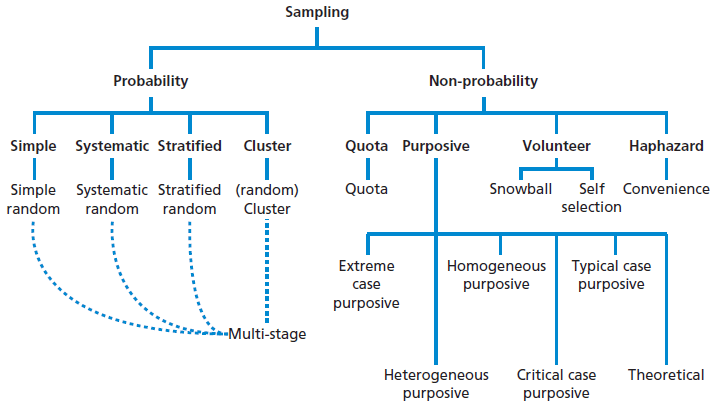

<p class="bibref">https://i0.wp.com/research-methodology.net/wp-content/uploads/2012/04/Sampling-in-primary-data-collection1.png</p>

----

Si no se puede constrastar la representatividad, lo cual es muy frecuente, los muestreos probabilísticos permiten, al menos, estimar el error promedio que se puede estar cometiendo.

Ello no es posible con los muestreos no probabilísticos.


## Muestreo en contextos industriales

En contextos industriales, las opciones de muestreo más frecuentes son

- el muestreo exhaustivo o 100 %,
- los muestreos probabilísticos, especialmente simples, sistemáticos o estratificados,
- o muestreos de conveniencia.

De ellos, los más adecuados son los muestreos aleatorios, simples o estratificados.


## Efecto del tamaño de muestra

Cuando se pretende conocer un valor real (parámetro poblacional), es común establecer un intervalo de confianza para el mismo.
La incertidumbre (o semiamplitud del intervalo de confianza) depende normalmente de 1/raiz(n).

De esta forma, cuando mayor sea el tamaño de muestra menor será la incertidumbre del resultado, o lo que es lo mismo el riesgo de tomar una decisión incorrecta.


# Muestreo de aceptación por atributos (MIL-STD-105)

## Conceptos

- Inspección por atributos
    - Inspección por la que el elemento se clasifica simplemente como conforme o no-conforme con respecto a un requisito especificado o conjunto de requisitos especificados.
- No-conformidad
    - Es el incumplimiento de una especificación. Su aparición se supone que es al azar e independientes unas de otras.
- Lote
    - Agregación de productos fabricados bajo un sistema común de causas que le dota de una uniformidad inherente.


## Objetivos

- Inducir a un proveedor a mantenerse por encima de un mínimo de calidad, con un riesgo establecido de ver un lote rechazado cuando se está produciendo al nivel de calidad acordado.
- Permitir que el consumidor tenga un riesgo mínimo (controlado) de aceptar ocasionalmente un lote de menor calidad.
- Llevar a cabo el control con un nivel de costes adecuado y de forma adecuada desde un punto de vista estadístico.


## Recomendaciones para la formación de lotes

- No mezclar productos de diferentes fuentes (procesos, cambios de producción, materiales de entrada, etc.) a menos que haya evidencia de que la variación de lote a lote es lo suficientemente pequeña para ser ignorada.
- No acumular el producto durante largos periodos de tiempo (para la formación de lotes).
- Hacer lotes lo más grandes posible para aprovechar los bajos costos de muestreo proporcional. (El tamaño de las muestras no aumenta mucho a pesar de los grandes aumentos en el tamaño de los lotes).


## Normas para el muestreo de aceptación por atributos

- MIL-STD-105 - Sampling procedures and tables for inspection by attributes
- ANSI/ASQ Z1.4 - Sampling procedures and tables for inspection by attributes
- ISO 2859 - Sampling procedures for inspection by attributes. https://www.iso.org/obp/ui/#iso:std:iso:28590

----

La primera norma fue la MIL-STD-105. La primera versión de la misma, MIL-STD-105A, es del año 1950.

La cuarta edición, MIL-STD-105D, de 1963, sirvió de base a las normas ANSI/ASQ Z1.4 y la ISO 2859.

La quinta edición, MIL-STD-105E (https://archive.org/details/MIL-STD-105E_1), de 1989, es la última edición existente.


## MIL-STD-105E

Las normas de muestreo de aceptación permiten obtener

- a partir de 
    - nivel de calidad aceptable (*AQL*: *acceptance quality limit*)
    - tamaño de lote (*lot or batch size*)
    - plan de muestreo (*sampling plan*)
    - nivel de inspección (*inspection level*)
    - procedimiento de inspección (*inspection procedure*)

----

<p>&nbsp;</p>

- se obtiene
    - el tamaño de la muestra a inspeccionar (*sample size*)
    - el número máximo de no-conformidades que podemos aceptar (*Ac*: *Acceptance number*)
    - el número mínimo de no-conformidades a partir de las cuales debemos rechazar (*Re*: *Rejection number*)

----

Habiéndose fijado *a priori*

- nivel de calidad aceptable (*AQL*: *acceptance quality limit*)
- nivel de inspección (*inspection level*), por defecto el II

<p>&nbsp;</p>
 
 
### Procedimiento - Selección de los criterios de inspección

1. Consultar en la tabla I, el código de tamaño de muestra, para el nivel de inspección y el tamaño  de lote a inspeccionar.

----

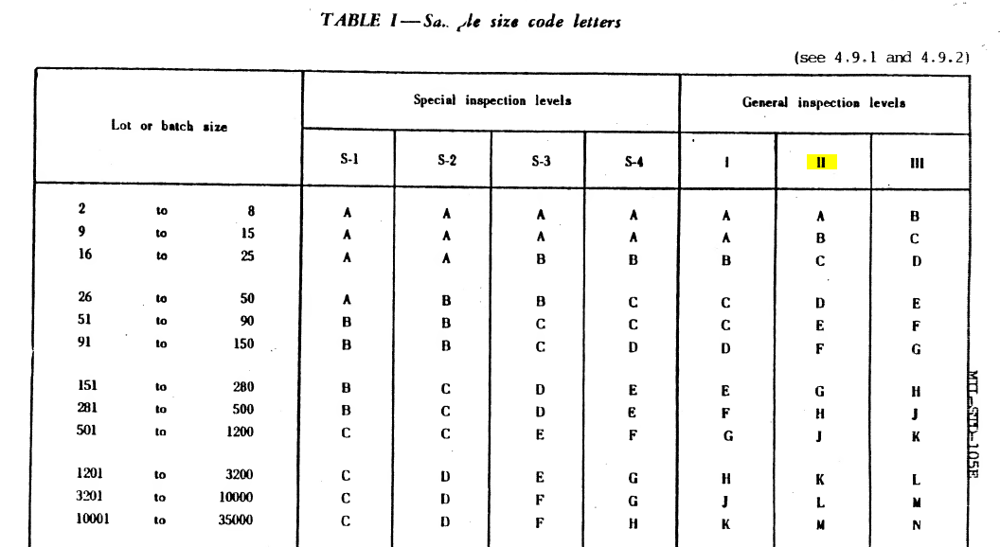

----

<p>&nbsp;</p>

2. De acuerdo con el plan de muestreo (simple, doble o múltiple) y el procedimiento de inspección (reducido, normal o estricto), se selecciona la tabla adecuada.
3. Con el *AQL* y el código de tamaño de muestra, se lee en la tabla
    - el tamaño de muestra,
    - el número de aceptación,
    - y el número de rechazo.

----

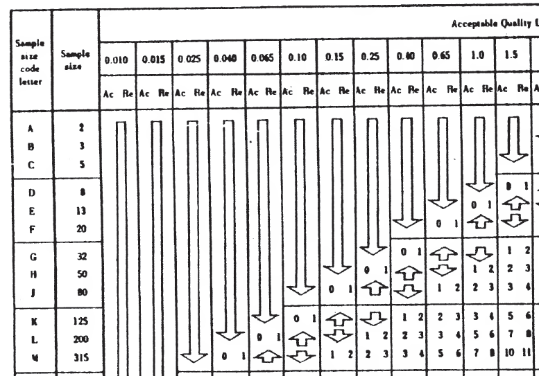

----

### Procedimiento - Inspección (muestreo simple)

4. Se seleccionan de acuerdo con un muestreo adecuado las unidades que deben ser inspeccionadas.
    - Si el número de unidades no-conformes o de defectos es inferior o igual al número de aceptación, se acepta el lote.
    - Si el número de unidades no-conformes o de defectos es igual o superior al número de rechazo, se rechaza el lote.
    - Si el número de unidades no-conformes o de defectos es superior al número de aceptación e inferior al de rechazo, se acepta el lote aunque, a nivel del procedimiento de cambio de procedimiento de inspección, se considera como rechazado.

----

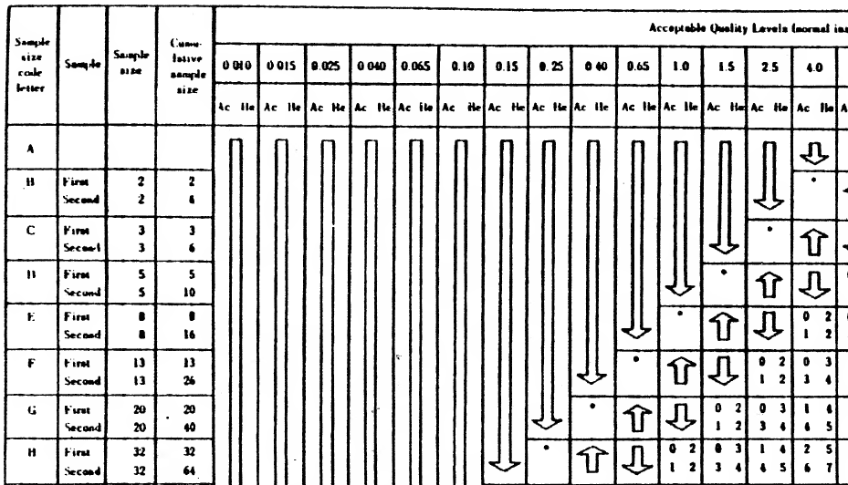

----

### Procedimiento - Inspección (muestreo doble)

<div style="font-size:28px;">

4. Se seleccionan de acuerdo con un muestreo adecuado las unidades que deben ser inspeccionadas en el primer muestreo.
    - Si el número de unidades no-conformes o de defectos es inferior o igual al número de aceptación, se acepta el lote.
    - Si el número de unidades no-conformes o de defectos es igual o superior al número de rechazo, se rechaza el lote.
    - Si el número de unidades no-conformes o de defectos es superior al número de aceptación e inferior al de rechazo, se procede al segundo muestreo.

</div>

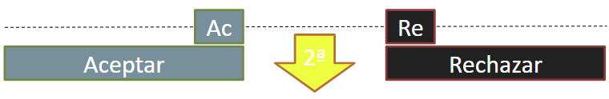{style=width:80%;margin-left:-40%;}

----

{style=width:80%;margin-left:-40%;}

<div style="font-size:28px;">

5. Se seleccionan de acuerdo con un muestreo adecuado las unidades que deben ser inspeccionadas en el segundo muestreo.
    - Si el número total de unidades no-conformes o de defectos es inferior o igual al número de aceptación, se acepta el lote.
    - Si el número total de unidades no-conformes o de defectos es igual o superior al número de rechazo, se rechaza el lote.
    - Si el número total de unidades no-conformes o de defectos es superior al número de aceptación e inferior al de rechazo, se acepta el lote aunque, a nivel del procedimiento de cambio de procedimiento de inspección, se considera como rechazado.

</div>


## Cambio del procedimiento de inspección

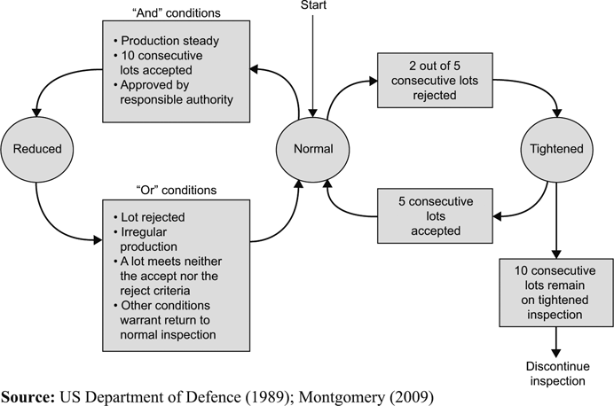{style=width:60%;margin-left:-30%;}

<p class="bibref">http://www.cqeacademy.com/cqe-body-of-knowledge/product-process-control/acceptance-sampling</p>


## Ejemplo

A la empresa llega un camión con un pedido de 125000 pulsadores para spray, repartidos en 30 cajas. ¿Se debe aceptar el pedido?

Habrá que verificar que los tapones cumplen con las exigencias de  calidad examinando una  muestra representativa ya que no hay recursos para examinarlos todos

¿Cuántos tapones tengo que revisar si el nivel de calidad aceptable se ha establecido en el 1 %?


# Muestreo de aceptación por variables (MIL-STD-414)

## Conceptos

- Inspección por variables
    - Inspección en la que una propiedad del elemento es medida y puesta en comparación con los límites de especificación para la propiedad medida. En esta comparación, la distancia a los límites se tiene en cuenta para la extracción de conclusiones.
- No-conformidad
    - Corresponde a la presencia de un valor más allá de los límites de especificación.
- Lote
    - Agregación de productos fabricados bajo un sistema común de causas que le dota de una uniformidad inherente.


## Objetivos y lotes

El muestreo de aceptación por variables persigue los mismos objetivos que el muestreo de aceptación por atributos: mantener unos riesgos controlados del productor y del consumidor, e inducir a una producción de mayor calidad.

Los criterios para la formación de lotes (homogéneos y grandes) siguen siendo válidos.


## Normas para el muestreo de aceptación por variables

- MIL-STD-414 - Sampling procedures and tables for inspection by variables for percent defective. https://archive.org/details/MIL-STD-414  
- ANSI/ASQ Z1.9 - Sampling procedures and tables for inspection by variables for percent nonconforming
- ISO 3951 - Sampling procedures for inspection by variables. https://www.iso.org/standard/57490.html

La primera de ellas, la MIL-STD-414, está fechada en 1957. Esta ha servido de referencia para las demás normas.


## MIL-STD-414

Esta norma asume que:

- Se considera una sola característica medible sobre una escala continua.
- El error de medición es despreciable.
- La fabricación está bajo control estadístico.
- La variable se distribuye de acuerdo a una distribución normal.

----

La norma ML-STD-414 permite obtener 

- a partir de 
    - nivel de calidad aceptable (*AQL*: *acceptance quality limit*)
    - tamaño de lote (*lot or batch size*)
    - plan de muestreo (*sampling plan*)
    - nivel de inspección (*inspection level*)
    - procedimiento de inspección (*inspection procedure*)
    - límites de especificación (*LIE* o *L*, y *LSE* o *U*)

----

<p>&nbsp;</p>

- se obtiene
    - el tamaño de la muestra a inspeccionar (*sample size*)
    - un conjunto de criterios para establecer si el lote es aceptable o no

----

La norma propone distintos procedimientos en función de la forma como se calcula la variabilidad de la variable:

- calculada a partir de la desviación estándar de la muestra, 
- calculada a partir del rango de la muestra, o
- conocida,

del número de límites de especificación, y del número de níveles de calidad aceptables (*AQL*) distintos.

Solo consideraremos el método de la desviación estándar para dos límites de especificación con *AQL* iguales.

----

Habiéndose fijado *a priori*

- los límites de especificación (*L* y *U*),
- el nivel de calidad aceptable (*AQL*),
- el nivel de inspección (*inspection level*), por defecto el IV

----

### Procedimiento - Selección de los criterios de inspección

1. Consultar en la tabla A-2, el código de tamaño de muestra, para el nivel de inspección y el tamaño de lote a inspeccionar.

----

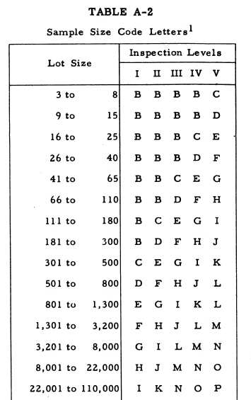{style=width:80%;margin-left:-40%;}

----

<p>&nbsp;</p>

2. De acuerdo con el procedimiento de inspección (reducido, normal o estricto), se selecciona la tabla adecuada (B-3 para normal o estricto -parte inferior-, o B-4 para reducido).
3. Con el *AQL* y el código de tamaño de muestra, se lee en la tabla
    - el tamaño de muestra,
    - y la proporción de no-conformes máxima aceptable (*M*).

----

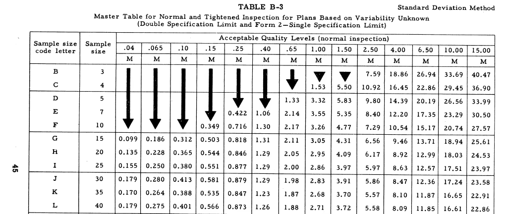

----

### Procedimiento - Inspección

4. Se seleccionan de acuerdo con un muestreo adecuado las unidades que deben ser inspeccionadas. Se determina la propiedad de interés para cada una de estas unidades.
5. Se determina el promedio ($\bar X$) y la desviación estándar ($s$) de las medidas.
6. Se rechaza el lote si el promedio se encuentra fuera de los límites de especificación ($\bar X > U$ o $\bar X < L$).
7. Se calculan los índices de calidad para cada uno de los límites de especificación

$$ \\
Q_L = \dfrac {\bar X - L}{s} \\
Q_U = \dfrac {U - \bar X}{s} $$

----

8. Se determina la proporción de no-conformes para ambos límites de especificación (usando la tabla B-5) ($p_L$ y $p_U$).

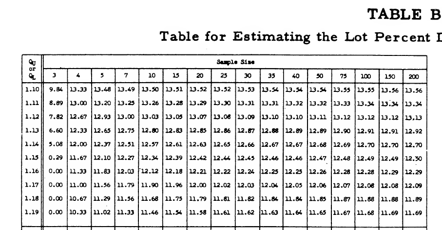

----

9. Se suman $p_L$ y $p_U$ para obtener la proporción de no-conformes.

$$\\
  p = p_L +p_U$$

10. Si la proporción de no-conformes ($p$) es mayor que la máxima tabulada (*M*) se rechaza el lote. En caso contrario, el lote se acepta.


## Cambio del procedimiento de inspección

Se empieza el proceso con inspección normal.


### Inspección estricta

Se establece cuando

- el promedio estimado de proceso ($\bar p$), promedio de las *k* (por defecto 10) últimas proporciones de no-conformes ($p$), es superior al *AQL*, o
- un número superior a *T* lotes (tabla B-6) tiene una proporción de no-conformes al *AQL*.

Se vuelve a la inspección normal

- el promedio estimado de proceso ($\bar p$) es inferior o igual al *AQL*, 

----

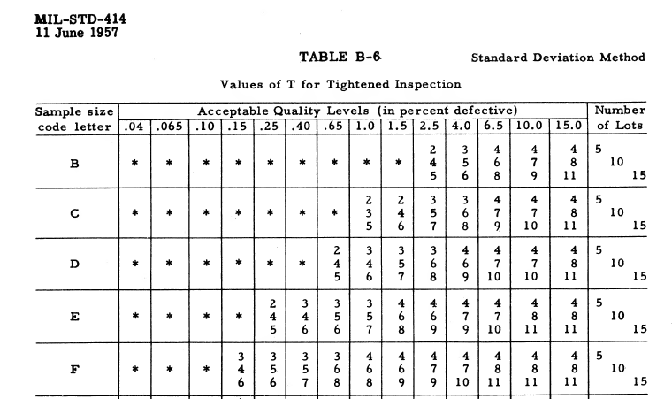

----

### Inspección reducida

Se establece si

- ninguno de los *k* lotes previos ha sido rechazado,
- ninguno de los lotes anterior tiene una proporción de no-conformes ($p$) superior a un valor tabulado (tabla B-7), y
- la producción es estable.

Se vuelve al procedimiento normal cuando

- un lote es rechazado,
- el promedio estimado de proceso ($\bar p$) es superior al *AQL*,
- la producción es inestable, o
- se produce cualquier otra situación que inste a volver a normal.

----

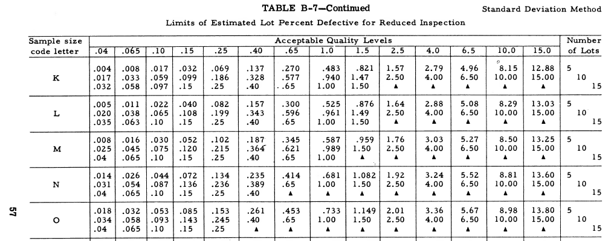


## Ejemplo

Reproducir el ejemplo B-3 que figura en la norma MIL-STD-414.


## Ejemplo 2

Las especificación para el pH de un champú señala que se debe encontrar entre 5,5 y 6,5.  Se ha fabricado un lote piloto de 100 unidades. ¿Cómo debería proceder para determinar la aceptación o no del lote?

Una vez determinado el tamaño de muestra selecciona el archivo phNNNN.txt que corresponda (sustituyendo NNNN por el tamaño de muestra escrito con 4 dígitos) y determina si el lote es aceptable o no, para un AQL de 0,1 %.


# Sistemas alternativos de muestreo de aceptación

##

Los sistemas de aceptación considerados estan siendo sustituidos en algunos casos por sistemas basados en la aceptación a 0, y sistemas de muestreo de aceptación secuencial.

En el primer caso, el lote solo es aceptable si no existen unidades no-conformes. La referencia en estos casos es la norma MIL-STD-1916 cuya primera edición es de 1996 (
https://variation.com/wp-content/uploads/standards/mil-std-1916.pdf).

----

En el segundo caso, el tamaño de muestra no se establece a priori sino que se incrementa de forma secuencial cuando aun no es posible llegar a una conclusión de aceptación o rechazo. Una descripción puede encontrarse en https://www.itl.nist.gov/div898/handbook/pmc/section2/pmc26.htm y una norma de referencia es la MIL-STD-1235C de 1988 (https://elsmar.com/pdf_files/Military%20Standards/mil%20std%201235c.pdf). Los sistemas de muestreo secuencial también están incluidos en las normas ISO 2859 e ISO 3951.


# Referencias normativas

##

- MIL-STD-105 - Sampling procedures and tables for inspection by attributes. https://archive.org/details/MIL-STD-105E_1
- MIL-STD-414 - Sampling procedures and tables for inspection by variables for percent defective. https://archive.org/details/MIL-STD-414  
- ANSI/ASQ Z1.4 - Sampling procedures and tables for inspection by attributes
- ANSI/ASQ Z1.9 - Sampling procedures and tables for inspection by variables for percent nonconforming
- ISO 2859 - Sampling procedures for inspection by attributes. https://www.iso.org/obp/ui/#iso:std:iso:28590
- ISO 3951 - Sampling procedures for inspection by variables. https://www.iso.org/standard/57490.html

----

- MIL-STD-1916 - DOD PREFERRED METHODS FOR ACCEPTANCE OF PRODUCT. https://variation.com/wp-content/uploads/standards/mil-std-1916.pdf
- MIL-STD-1235 - Single- and multi-level continous sampling procedures and tables for inspection by attributes. Functional curves of continous sampling plans. https://elsmar.com/pdf_files/Military%20Standards/mil%20std%201235c.pdf

Una lista más completa de normas para muestreos de aceptación puede encontrarse en https://variation.com/acceptance-sampling-standards/
