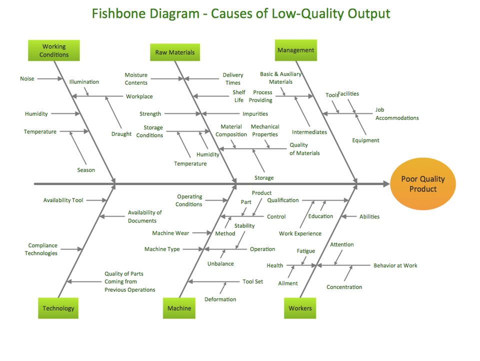
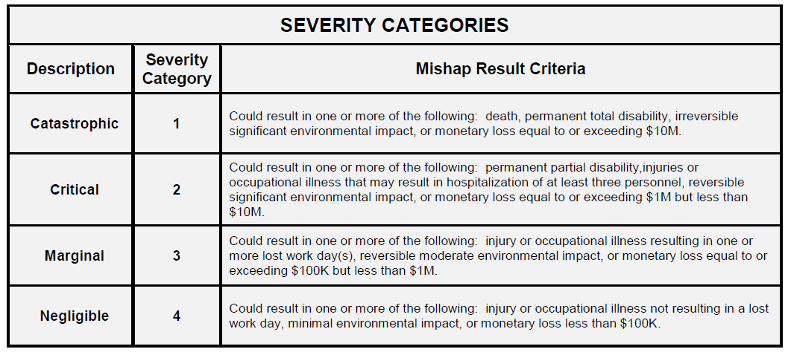
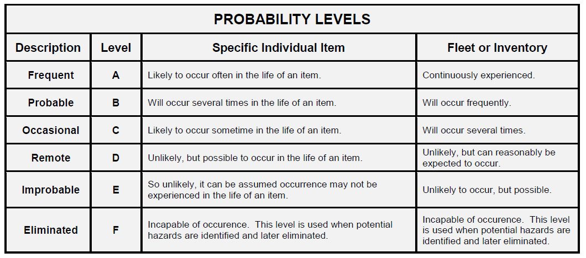
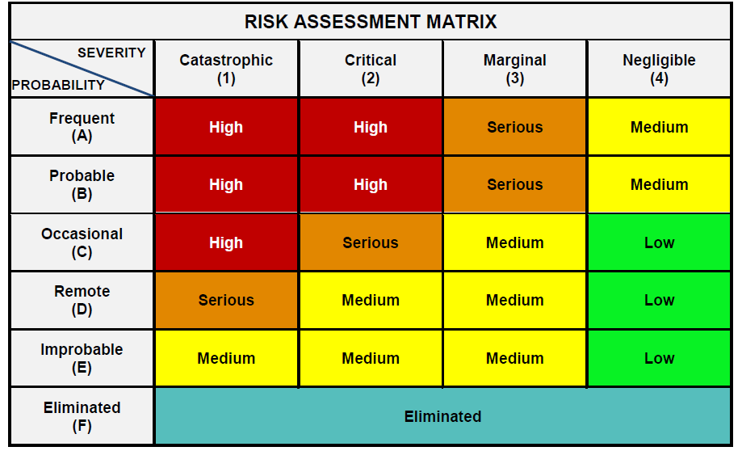

---
output:
  revealjs::revealjs_presentation:
    theme: simple
    slide_level: 2
    highlight: pygments
    center: false
    self_contained: true
    css: "../css/styles.css"
    reveal_options:
      slideNumber: true
      previewLinks: false
      transition: 0
      background_transition: 0
editor_options: 
  chunk_output_type: console
---

```{r setup, include=FALSE}
knitr::opts_chunk$set(echo = FALSE, dev="svg")
```

```{r include=FALSE}
if(!require("tidyverse")) {
  install.packages("tidyverse", repos="https://cloud.r-project.org/",
         quiet=TRUE, type="binary")
  library("tidyverse")
}
if(!require("car")) {
  install.packages("car", repos="https://cloud.r-project.org/",
         quiet=TRUE, type="binary")
  library("car")
}
if(!require("kableExtra")) {
  install.packages("kableExtra", repos="https://cloud.r-project.org/",
         quiet=TRUE, type="binary")
  library("kableExtra")
}
```

##


<div style="font-size:1.5em;font-weight:700;margin-top:200px;">Control estadístico de procesos</div>
<div style="font-size:1.4em;font-weight:500;color:#333333;">Diseño de experimentos</div>
<div style="font-size:1.2em;margin-top:40px;color:#333333;">Jordi Cuadros, Lucinio González</div>
<div style="margin-top:80px;color:#333333;">Noviembre de 2018</div>


# Análisis y mejora del proceso

## Pasos en la mejora del proceso

- Caracterización del problema de mejora
    - Identificación del problema o la variable de respuesta
    - *Root-cause analysis*, identificación de las posibles causas
    - Priorización de las posibles causas
- Investigación: Obtención de datos y toma de decisiones
    - Diseño de experimentos
        - Estudios de un factor
        - Diseños de múltiples factores
    - Experimentos *ex-post-facto*: Minería de datos y análisis correlacionales.


# Caracterización del problema de mejora

## Identificación del problema o la variable de respuesta

- Todo proceso de mejora empieza identificando el objeto de esta mejora
    - Incidente
    - Valor de una característica del proceso o del producto
    - Petición de mejora
    - ...
- Para su análisis cuantitativo, esta variable tendrá que ser cuantificada de una forma u otra. Es conveniente por tanto, dotar la misma de una expresión numérica.


## *Root-cause Analysis*

- Una vez identificada la respuesta objeto de estudio o mejora, debe analizarse qué variables/factores pueden estar influyendo en el valor de la misma.
- Para ello se usan distintas técnicas de tipo cualitativo que conforman lo que se conoce como RCA (*Root-cause analysis*). Todas ellas pretenden llegar a obtener un listado relativamente exhaustivo de aquello que pueda haber producido un determinado resultado o efecto o bien a la causa cuya eliminación permite evitar que pueda repetirse el problema.

----

### Técnicas para el RCA

- 5 Why's
- Diagrama de espina de pez, *Fishbone diagram* (or diagrama de Ishikawa)
- FMEA/FMECA (*Failure mode, effects and criticality analysis*)


## 5 Why's

<iframe width="642" height="361" src="https://www.youtube.com/embed/JmrAkHafwHI" frameborder="0" allow="accelerometer; autoplay; encrypted-media; gyroscope; picture-in-picture" allowfullscreen></iframe>

<span class="bibref">https://www.youtube.com/watch?v=JmrAkHafwHI</span>


## 5 Why's

- Establecer un equipo de trabajo.
- Preguntarse el porqué hasta encontrar causas actuables (últimas).
- Seguir varias causas si aparecen más de una.
- Identificar actuaciones a los distintos niveles. Distribuir esfuerzos y costes en los distintos níveles.
- **NUNCA** dejar como causas últimas errores individuales. Las causas siempre estan en los procesos.

----

### Referencias adicionales

- https://www.adb.org/sites/default/files/publication/27641/five-whys-technique.pdf 
- https://www.mindtools.com/pages/article/newTMC_5W.htm
- https://www.bulsuk.com/2009/03/5-why-finding-root-causes.html 
- https://open.buffer.com/5-whys-process/
- https://www.youtube.com/watch?v=51aKj3MYBvs


## Diagrama de espina de pez

<iframe width="642" height="361" src="https://www.youtube.com/embed/RkPBiAUGo-M" frameborder="0" allow="accelerometer; autoplay; encrypted-media; gyroscope; picture-in-picture" allowfullscreen></iframe>

<span class="bibref">https://www.youtube.com/watch?v=RkPBiAUGo-M</span>


## Diagrama de espina de pez

 

<span class="bibref">https://sites.ualberta.ca/~yreshef/orga432/fishbone.html</span>


### Referencias adicionales

- https://www.isixsigma.com/tools-templates/cause-effect/cause-and-effect-aka-fishbone-diagram/
- http://asq.org/learn-about-quality/cause-analysis-tools/overview/fishbone.html 
- https://sixsigmastudyguide.com/six-ms-6ms-or-5ms-and-one-p-5m1p/
- https://www.youtube.com/watch?v=ZS8Re23Z_4k


## Priorización de causas o *Criticality analysis*

Estrategias como el diagrama de espina de pez generan un número generalmente importante de posibles causas ante un fenómeno. Es necesario a continuación priorizar de forma reflexiva su estudio y/o resolución.

Existen distintas estrategias de priorización:

- Frecuencia
- Matriz de causas y efectos, http://www.six-sigma-material.com/Correlation-Matrix.html
- FMEA / FMECA (*Failure Mode, Effects and Criticality Analysis*), http://www.six-sigma-material.com/FMEA.html 
    - SEVERITY · OCCURRENCE · DETECTION = RPN

----

 

<span class="bibref">MIL-STD-882E. System Safety.</span>

----

 

<span class="bibref">MIL-STD-882E. System Safety.</span>

----

 

<span class="bibref">MIL-STD-882E. System Safety.</span>


# Investigación

## Necesidad de investigar

Una vez identificadas las causas potenciales de un determinado suceso o efecto a menudo es necesario recopilar más datos o más información para...

- Determinar si una causa potencial tiene efecto real en el resultado
- Establecer la importancia relativa de distintos factores
- Determinar valores óptimos de cada factor
- ...

Ello implica investigar.


## Tipos de investigación

En este curso se discutirán

- Investigación experimental: Diseño de experimentos
- Investigación *ex-post-facto*: Análisis correlacional


# Investigación experimental: Diseño de experimentos

## Objetivos en un diseño experimental

- MAXIMIZAR el efecto
    - MAXIMIZAR la variabilidad de la variable independiente
- MINIMIZAR el error de medida
    - Detallar el proceso de determinación de la variable dependiente
    - Usar instrumentos fiables
    - Tamaño de muestra grande
    - Homogeneidad de las muestras
- CONTROLAR las variables intervinientes
    - CONSTANCIA
    - ALEATORIZACIÓN
    - BLOQUEO
    - TRATAMIENTO ESTADÍSTICO


## Proceso de un diseño experimental

- Identificar las variables experimentales
- Establecer los niveles de las variables
- Establecer el proceso experimental
- Establecer la hipótesis experimental y las hipótesis estadísticas
- Recoger datos
- Ejecutar la prueba estadística más adecuada 
- Concluir


## Identificar las variables experimentales

- Pasos previos
    - Identificada la variable o función respuesta
    - Identificados los posibles factores
    - Priorizados los más importantes

- De los factores priorizados
    - ¿Cuáles pueden ser controlados y van a ser incluidos en el diseño experimental?
    - ¿Cuáles pueden ser constantes?
    - ¿Cuáles pueden ser aleatorizados?
    - ¿Cuáles pueden bloquearse?


## Establecer los niveles de las variables

- Se denominan niveles los distintos valores de la variables experimental que van a ser incluidos en el experimento. Se suelen tratar como variable discreta (factor).

- Debe considerarse:
    - El rango de validez del factor
    - El número de niveles a usar (habitualmente 2 a no ser que haya sospechas de no-linealidad)
    - El coste; da más información la realización secuencial de experimentos que la realización de un experimento con más niveles.

----

- Si la variable es cualitativa, se usan los valores habituales (más comunes) de la variable.
- Si la variable es cuantitativa,
    - Se suele establecer niveles equiespaciados (si son más de 2) y suficientemente separados en el dominio de validez del factor (MAX),
    - Es habitual evitar los extremos para minimizar el riesgo de estar fuera del dominio experimental.


## Establecer el proceso experimental

- El número de variables experimentales y bloqueadas (y el número de experiencias que es posible realizar) establecerá el tipo de diseño experimental a usar
- Veremos en esta sesión y en las siguientes:
    - Diseños de un factor
    - Diseños factoriales completos de varios factores
    - Diseños factoriales fraccionados y saturados


## Establecer las hipótesis y ejecutar la prueba estadística más adecuada

- Para resolver el experimento, debe concretarse una hipótesis experimental.
- Esta hipótesis experimental se traduce a dos hipótesis estadísticas:
    - la hipótesis nula, y
    - la hipótesis alternativa.
- El diseño usado, las hipótesis estadísticas y la naturaleza de los datos, permiten establecer una prueba estadística adecuada.
- Se comprueban los supuestos de la prueba y se lleva a cabo la misma (si los supuestos se cumplen) .


## Diseños de un factor

- Criterios generales
    - Con repetición
    - Balanceados
    - Completamente aleatorizados (orden aleatorio de los experimentos)
- Diseños de un factor
    - Dos niveles con datos apareados
    - Dos niveles con muestras independientes
    - Más de dos niveles


## Diseño de un factor con dos niveles - datos apareados

Corresponde a aquella situación en la que cada observación puede hacerse para los dos niveles del factor manteniéndose constantes todas las variables que corresponden al individuo evaluado. Ello permite reducir la variabilidad experimental.

----

El análisis de este diseño se realiza en dos pasos:

1. Estudio de la normalidad de las diferencias
    - Prueba de Shapiro-Wilk,  ```shapiro.test(...)```
    - Gráfico QQ,  ```ggplot(... aes(sample=...)) + geom_qq(...)```
2. Inferencia sobre la media (o la mediana) de la distribución de las diferencias
    - Prueba t (para variables normalmente distribuidas),  ```t.test(...)```
    - Prueba de Wilcoxon,  ```wilcox.test(...)```


## Ejemplo

En el control de calidad de una industria de fabricación de jácenas, se ha decidido comparar dos métodos para determinar la resistencia a la cizalla de las bigas producidas. 

De acuerdo con los datos que figuran en el fichero 'vigas.txt', determina si ambos métodos de determinación pueden considerarse equivalentes.

----

```{r, echo = FALSE, results = 'asis'}
datos <- read.table("vigas.txt", header=TRUE, dec=".", sep=";")
kable_styling(kable(datos), font_size=28)
```

----

```{r, echo = TRUE}
datos$Dif <- datos$Metodo1 - datos$Metodo2
shapiro.test(datos$Dif)
```

```{r, eval=FALSE, echo = TRUE}
ggplot(datos, aes(sample=Dif)) +
  geom_qq() + geom_qq_line() + theme_classic()
```

----

```{r, echo = FALSE}
ggplot(datos, aes(sample=Dif)) +
  geom_qq() + geom_qq_line() + theme_classic()
```

----

```{r, echo = TRUE}
t.test(datos$Dif)
```

----

```{r, echo = TRUE}
wilcox.test(datos$Dif)
```


## Diseño de un factor con dos niveles - datos independientes

Corresponde a aquella situación en que las observaciones para un nivel no tienen relación con las observaciones para el segundo nivel.

En este caso, es frecuente querer comparar los valores centrales o/y las variabilidades correspondientes a ambos niveles de la variable independiente.

----

El análisis para la comparación de los valores centrales se realiza en dos pasos:

1. Estudio de la normalidad para cada nivel
    - Prueba de Shapiro-Wilk,  ```shapiro.test(...)```
    - Gráfico QQ,  ```ggplot(... aes(sample=...)) + geom_qq(...)```
2. Inferencia sobre las medias (o las medianas) de los niveles
    - Prueba t de Welch (para variables normalmente distribuidas),  ```t.test(...)```
    - Prueba de Mann-Whitney (o de Wilcoxon),  ```wilcox.test(...)```

----

Para la comparación de las variabilidades se procede del modo siguiente:

1. Estudio de la normalidad para cada nivel
    - Prueba de Shapiro-Wilk,  ```shapiro.test(...)```
    - Gráfico QQ,  ```ggplot(... aes(sample=...)) + geom_qq(...)```
2. Inferencia sobre las varianzas de los resultados de ambos niveles
    - Prueba F (para variables normalmente distribuidas),  ```var.test(...)```
    - Prueba de Levene (o de Brown–Forsythe),  ```car::leveneTest(...)```


## Ejemplo

En una papelera, se ha decidido modificar la composición de las fibras usadas para la fabricación del papel para valorar si una mayor proporción de fibras de eucalipto, da lugar a un papel con mejores propiedades mecánicas (y menor variabilidad en las mismas).

Los resultados de la resistencia a la tracción para distintas producciones (en psi) se muestran en el fichero 'papel.txt'.

¿Qué conclusiones puedes sacar de los mismos?

----

<style>
.container{
    display: flex;
}
.col{
    flex: 1;
}
</style>

<div class="container">

<div class="col">

```{r, echo = FALSE, results = 'asis'}
datos <- read.table("papel.txt", sep="\t", header=TRUE)
datos$Prop <- factor(datos$Prop)
kable_styling(kable(datos[1:11,],row.names=FALSE), font_size=28)
```

</div>
<div class="col">

```{r, echo = FALSE, results = 'asis'}
kable_styling(kable(datos[12:22,],row.names=FALSE), font_size=28)
```

</div>
</div>

----

```{r, eval = FALSE, echo = TRUE}
datos <- read.table("papel.txt", sep="\t", header=TRUE)
datos$Prop <- factor(datos$Prop)
ggplot(datos, aes(x=Prop,y=Resist)) +
  geom_boxplot() +
  theme_classic()
```

----

```{r, echo = FALSE}
ggplot(datos, aes(x=Prop,y=Resist)) +
  geom_boxplot() +
  theme_classic()
```

----

```{r, echo = TRUE}
by(datos$Resist,datos$Prop,shapiro.test)
```

----

```{r, echo = TRUE}
t.test(datos$Resist ~ datos$Prop,
       alternative = "less")
```

----

```{r, echo = TRUE}
var.test(datos$Resist ~ datos$Prop,
       alternative = "greater")
```

----

### Conclusiones

Un mayor proporción de fibras de eucalipto parece dar lugar a un papel más resistente.
La variabilidad del proceso, respecto a esta propiedad, no parece disminuir.


## Diseño de un factor con más de dos niveles

Corresponde a aquella situación en que se desea establecer si más de dos valores de la variable independiente llevan a resultados equivalentes.

Estos resultados pueden ser equivalentes en cuanto a sus valores centrales o/y  sus variabilidades.

----

El análisis para la comparación de los valores centrales se realiza en dos pasos:

1. Estudio de la normalidad para cada nivel
    - Prueba de Shapiro-Wilk,  ```shapiro.test(...)```
    - Gráfico QQ,  ```ggplot(... aes(sample=...)) + geom_qq(...)```

Esta prueba se puede substituir por una prueba de normalidad de los residuales *a posteriori*.
  
----
  
2. Inferencia sobre las medias (o las medianas) de los niveles
    - Anova de Welch (para variables normalmente distribuidas),  ```oneway.test(...)```
    - Prueba de Kruskal-Wallis,   ```kruskal.test(...)```

----

Para la comparación de las variabilidades se procede del modo siguiente:

1. Estudio de la normalidad para cada nivel
    - Prueba de Shapiro-Wilk,  ```shapiro.test(...)```
    - Gráfico QQ, ```ggplot(... aes(sample=...)) + geom_qq(...)```
2. Inferencia sobre las varianzas de los resultados de ambos niveles
    - Prueba de Bartlett (para variables normalmente distribuidas),  ```bartlett.test(...)```
    - Prueba de Levene (o de Brown–Forsythe),  ```car::leveneTest(...)```


## Ejemplo

En la empresa donde estás haciendo las prácticas, estan evaluando la posibilidad de cambiar el proveedor de los pernos que usáis en el proceso de fabricación.

Han recibido ofertas de tres proveedores y entre las distintas consideraciones a tener en cuenta está la resistencia a la tracción de los mismos. Hechos los experimentos pertinentes para muestras aleatorias de 12 pernos de cada proveedor, fichero 'pernos.txt', ¿se puede afirmar que tienen la misma resistencia a la tracción (en MN m<sup>-2</sup>)? ¿y la misma variabilidad en esta propiedad?


<!-- # Investigación *ex-post-facto*: Análisis correlacional -->


# Referencias

##

- MIL-STD-1629A. Procedures for performing a failure mode, effects and criticality analysis . http://www.barringer1.com/mil_files/MIL-STD-1629RevA.pdf
- IEC 60812. Analysis techniques for system reliability – Procedure for failure mode and effects analysis (FMEA)
- MIL-STD-882E. System Safety.
https://www.system-safety.org/Documents/MIL-STD-882E.pdf
-  ARP9136. Aerospace Series - Root Cause Analysis and Problem Solving (9S Methodology)


